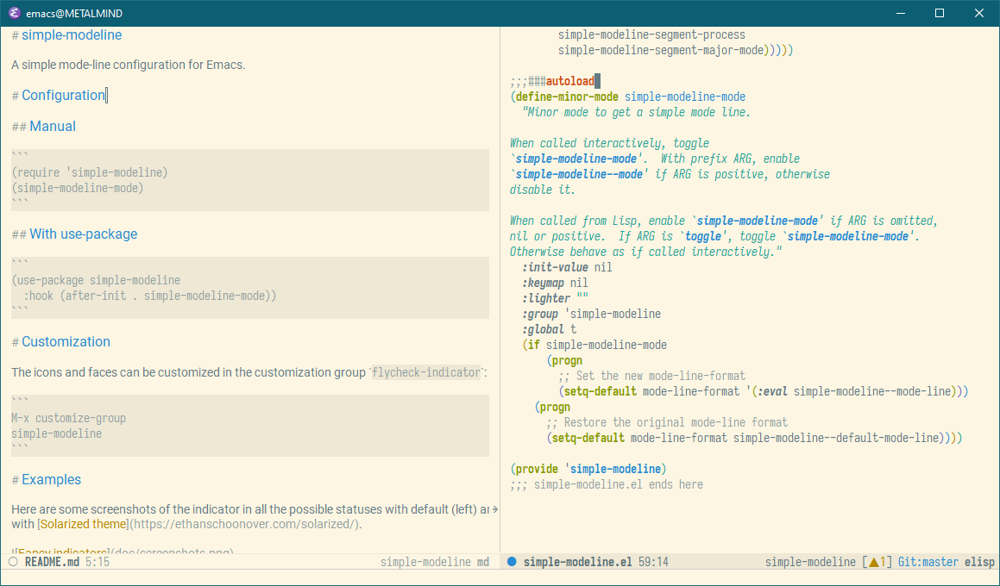

# simple-modeline

[](https://melpa.org/#/simple-modeline)

A simple mode-line configuration for Emacs.

# About

* Simple design
* Lightweight
* Split layout with left and right align segments
* Several predefined segments:
  - Modified/readonly indicator
  - Buffer name
  - Position and region info
  - Version control status
  - Encoding
  - EOL
  - Minor modes list
  - Process info
  - Input method
  - Major mode
* Simple creation of new segments with a macro

# Configuration

## Manual

```
(require 'simple-modeline)
(simple-modeline-mode)
```

## With use-package

```
(use-package simple-modeline
  :hook (after-init . simple-modeline-mode))
```

# Preview


